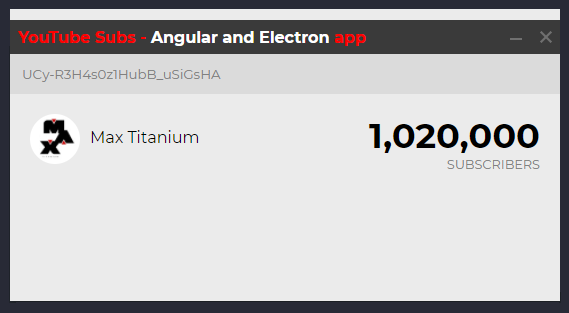

### Youtube Subscribers

> Projeto para entender funcionamento da estruturação de projeto com Angular e Electron desenvolvido por maximegris: [Github](https://github.com/maximegris).

#### Interface

### Descrição

App que comsome a API Data do youtube para levantar o número de inscritos em canais.

### Meta

Lucas Peixoto - [linkedin](https://www.linkedin.com/in/lucassacramoni/)

E-mail - lucas.sacramoni@yahoo.com
